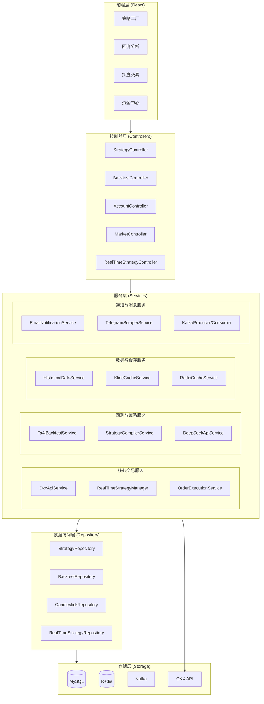
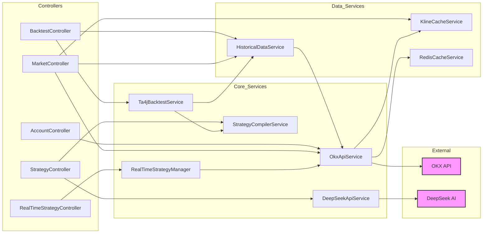
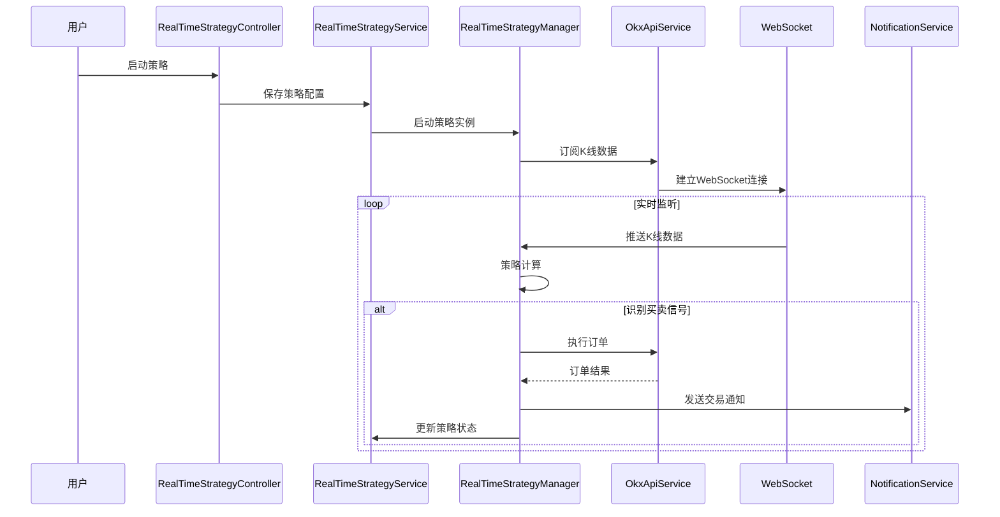
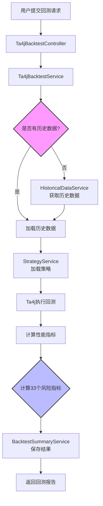
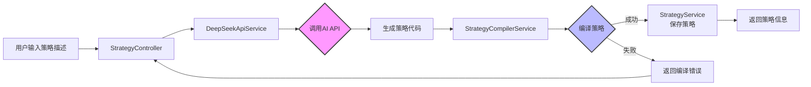
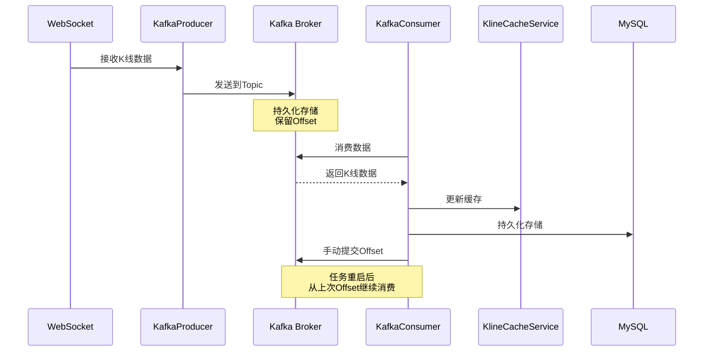
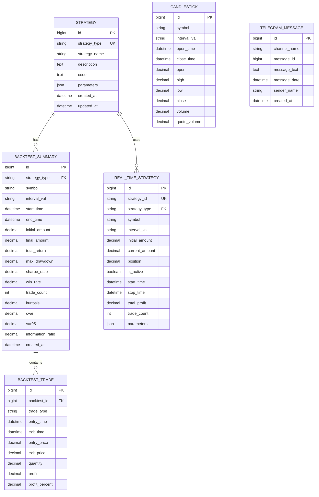
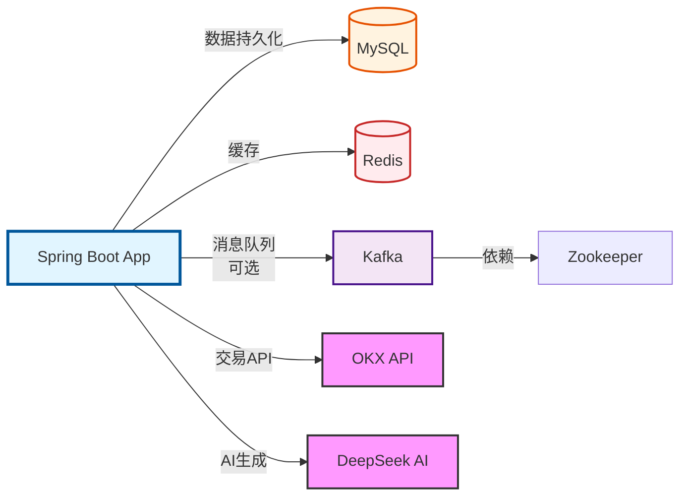
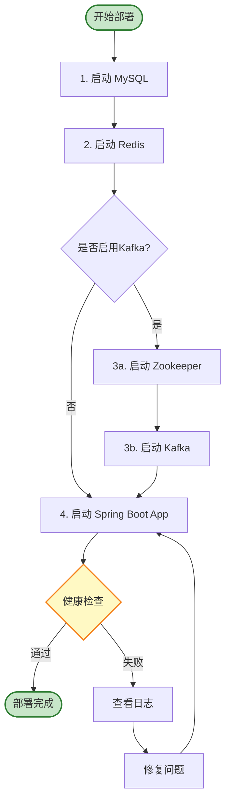

# OKX Trading 系统架构文档

## 📐 系统架构图

### 整体架构



### 服务依赖关系图



## 🏗️ 核心模块详解

### 1. 控制器层 (Controller Layer)

#### 1.1 StrategyController
**职责**: 策略管理的HTTP接口
- 策略CRUD操作
- AI策略生成
- 策略编译与加载
- 策略列表查询

**依赖**:
- `StrategyService`: 策略业务逻辑
- `DeepSeekApiService`: AI策略生成
- `StrategyCompilerService`: 策略编译

#### 1.2 Ta4jBacktestController
**职责**: 回测分析的HTTP接口
- 单策略回测
- 批量策略回测
- 回测结果查询
- 指标分布统计
- 动态评分计算

**依赖**:
- `Ta4jBacktestService`: 回测执行
- `BacktestSummaryService`: 回测结果管理
- `IndicatorDistributionService`: 指标分布分析

#### 1.3 AccountController
**职责**: 账户管理的HTTP接口
- 账户余额查询
- 持仓信息查询
- 订单历史查询
- 资金流水查询

**依赖**:
- `OkxApiService`: OKX API调用

#### 1.4 MarketController
**职责**: 市场数据的HTTP接口
- K线数据订阅/取消订阅
- 实时行情查询
- 历史数据获取
- 交易对列表查询

**依赖**:
- `OkxApiService`: 市场数据获取
- `HistoricalDataService`: 历史数据管理
- `KlineCacheService`: K线缓存
- `RedisCacheService`: Redis缓存

#### 1.5 RealTimeStrategyController
**职责**: 实盘策略管理的HTTP接口
- 实盘策略启动/停止
- 策略状态查询
- 策略参数配置
- 交易记录查询

**依赖**:
- `RealTimeStrategyService`: 实盘策略管理
- `RealTimeStrategyManager`: 策略执行引擎

---

### 2. 服务层 (Service Layer)

#### 2.1 核心交易服务

##### OkxApiService (接口)
**实现类**:
- `OkxApiWebSocketServiceImpl`: WebSocket实现（默认）
- `OkxApiRestServiceImpl`: REST API实现

**职责**:
- OKX交易所API调用
- WebSocket连接管理
- 实时行情订阅
- 订单执行
- 账户查询

**关键方法**:
```java
// 市场数据
Ticker getTicker(String symbol);
List<Candlestick> getKlineData(String symbol, String interval, Integer limit);
boolean subscribeKlineData(String symbol, String interval);

// 交易操作
Order createOrder(OrderRequest orderRequest);
Order cancelOrder(String orderId, String symbol);
List<Order> getOpenOrders(String symbol);

// 账户查询
AccountBalance getAccountBalance();
```

**依赖**:
- `WebSocketUtil`: WebSocket工具类
- `SignatureUtil`: API签名工具
- `RedisCacheService`: 价格缓存
- `KlineCacheService`: K线缓存
- `KlineKafkaProducerService`: Kafka生产者（可选）

##### RealTimeStrategyManager
**职责**: 实盘策略执行引擎
- 策略实例管理
- K线数据监听
- 交易信号识别
- 自动下单执行
- 持仓管理
- 风险控制

**关键功能**:
- 多策略并行运行
- 实时K线数据处理
- 买卖信号触发
- 订单状态跟踪
- 盈亏计算

**依赖**:
- `OkxApiService`: 交易执行
- `RealTimeStrategyService`: 策略持久化
- `NotificationService`: 交易通知

##### OrderExecutionService
**职责**: 订单执行与管理
- 订单创建与提交
- 订单状态跟踪
- 订单撤销
- 成交记录

**依赖**:
- `OkxApiService`: API调用

#### 2.2 回测与策略服务

##### Ta4jBacktestService
**职责**: 策略回测执行
- 单策略回测
- 批量回测
- 性能指标计算
- 交易记录生成

**关键方法**:
```java
BacktestResult runBacktest(BacktestRequest request);
List<BacktestResult> runAllStrategies(BacktestRequest request);
BacktestSummary calculateMetrics(BarSeries series, TradingRecord tradingRecord);
```

**依赖**:
- `HistoricalDataService`: 历史数据
- `StrategyService`: 策略加载
- `BacktestSummaryService`: 结果保存
- Ta4j库: 技术分析

##### StrategyCompilerService
**职责**: 动态策略编译
- Java代码编译
- 策略类加载
- 编译错误处理
- 多编译器支持（Janino、Java Compiler API）

**关键方法**:
```java
Class<?> compileStrategy(String code, String className);
Strategy loadStrategy(String strategyType);
```

**依赖**:
- Janino编译器
- Java Compiler API

##### DeepSeekApiService
**职责**: AI策略生成
- 自然语言理解
- 策略代码生成
- 代码优化建议

**依赖**:
- DeepSeek API
- HTTP客户端

#### 2.3 数据与缓存服务

##### HistoricalDataService
**职责**: 历史数据管理
- 历史K线数据获取
- 数据完整性检查
- 数据存储与查询
- 数据清理

**关键方法**:
```java
List<CandlestickEntity> fetchAndSaveHistoryWithIntegrityCheck(
    String symbol, String interval, String startTime, String endTime);
List<CandlestickEntity> getHistoricalData(
    String symbol, String interval, LocalDateTime start, LocalDateTime end);
```

**依赖**:
- `OkxApiService`: 数据获取
- `CandlestickRepository`: 数据持久化

##### KlineCacheService
**职责**: K线数据缓存
- 实时K线缓存
- 订阅管理
- 缓存更新
- 缓存清理

**依赖**:
- `RedisTemplate`: Redis操作

##### RedisCacheService
**职责**: 通用Redis缓存
- 价格缓存
- 交易对列表缓存
- 配置缓存

**依赖**:
- `RedisTemplate`: Redis操作

##### DataInitializationService
**职责**: 系统启动时数据初始化
- 加密货币列表初始化
- 股票列表初始化
- 缓存预热

**依赖**:
- `OkxApiService`: 数据获取
- `TushareApiService`: 股票数据
- `RedisTemplate`: 缓存写入

#### 2.4 通知与消息服务

##### NotificationService (接口)
**实现类**:
- `EmailNotificationServiceImpl`: 邮件通知
- `ServerChanNotificationServiceImpl`: Server酱通知
- `WechatCpNotificationServiceImpl`: 企业微信通知

**职责**:
- 交易通知
- 错误预警
- 策略状态通知

**依赖**:
- `JavaMailSender`: 邮件发送（Email实现）
- HTTP客户端: API调用（其他实现）

##### TelegramScraperService
**职责**: Telegram频道消息抓取
- 频道消息监听
- 消息解析与存储
- 频道管理
- 错误处理与重试

**依赖**:
- Telegram API
- `TelegramMessageRepository`: 消息存储

##### KlineKafkaProducerService / KlineKafkaConsumerService
**职责**: Kafka消息队列集成
- K线数据缓冲
- 消息生产与消费
- Offset管理
- 数据持久化

**依赖**:
- `KafkaTemplate`: Kafka操作
- `KlineCacheService`: 数据处理

---

### 3. 数据访问层 (Repository Layer)

#### 3.1 JPA Repositories

##### StrategyRepository
**职责**: 策略信息持久化
```java
List<StrategyEntity> findAll();
Optional<StrategyEntity> findByStrategyType(String strategyType);
```

##### BacktestSummaryRepository
**职责**: 回测结果持久化
```java
List<BacktestSummaryEntity> findBySymbolAndIntervalVal(String symbol, String interval);
List<BacktestSummaryEntity> findByStrategyType(String strategyType);
```

##### CandlestickRepository
**职责**: K线数据持久化
```java
List<CandlestickEntity> findBySymbolAndIntervalValAndOpenTimeBetween(
    String symbol, String interval, LocalDateTime start, LocalDateTime end);
```

##### RealTimeStrategyRepository
**职责**: 实盘策略持久化
```java
List<RealTimeStrategyEntity> findByIsActive(boolean isActive);
Optional<RealTimeStrategyEntity> findByStrategyId(String strategyId);
```

##### TelegramMessageRepository
**职责**: Telegram消息持久化
```java
List<TelegramMessageEntity> findByChannelNameOrderByMessageDateDesc(String channelName);
```

---

### 4. 工具类层 (Utility Layer)

#### WebSocketUtil
**职责**: WebSocket连接管理
- 连接建立与维护
- 消息发送与接收
- 心跳检测
- 重连机制

#### SignatureUtil
**职责**: API签名生成
- HMAC-SHA256签名
- 时间戳生成
- 请求签名

#### TechnicalIndicatorUtil
**职责**: 技术指标计算
- 自定义指标实现
- 指标组合
- 指标优化

#### BigDecimalUtil
**职责**: 精确数值计算
- 价格计算
- 数量计算
- 百分比计算

---

## 🔄 数据流图

### 实盘交易流程



### 回测流程



### AI策略生成流程



### Kafka K线数据缓冲流程



---

## 🗄️ 数据库设计

### 数据库ER图



### 核心表结构

#### strategy (策略表)
```sql
- id: 主键
- strategy_type: 策略类型
- strategy_name: 策略名称
- description: 策略描述
- code: 策略代码
- parameters: 策略参数(JSON)
- created_at: 创建时间
- updated_at: 更新时间
```

#### backtest_summary (回测摘要表)
```sql
- id: 主键
- strategy_type: 策略类型
- symbol: 交易对
- interval_val: K线周期
- start_time: 开始时间
- end_time: 结束时间
- initial_amount: 初始资金
- final_amount: 最终资金
- total_return: 总收益率
- max_drawdown: 最大回撤
- sharpe_ratio: 夏普比率
- win_rate: 胜率
- trade_count: 交易次数
- ... (33个风险指标)
- created_at: 创建时间
```

#### candlestick (K线数据表)
```sql
- id: 主键
- symbol: 交易对
- interval_val: K线周期
- open_time: 开盘时间
- close_time: 收盘时间
- open: 开盘价
- high: 最高价
- low: 最低价
- close: 收盘价
- volume: 成交量
- quote_volume: 成交额
```

#### real_time_strategy (实盘策略表)
```sql
- id: 主键
- strategy_id: 策略ID
- strategy_type: 策略类型
- symbol: 交易对
- interval_val: K线周期
- initial_amount: 初始资金
- current_amount: 当前资金
- position: 持仓数量
- is_active: 是否激活
- start_time: 启动时间
- stop_time: 停止时间
- total_profit: 总盈亏
- trade_count: 交易次数
- ... (策略参数)
```

#### telegram_message (Telegram消息表)
```sql
- id: 主键
- channel_name: 频道名称
- message_id: 消息ID
- message_text: 消息内容
- message_date: 消息时间
- sender_name: 发送者
- created_at: 创建时间
```

---

## 🔧 配置管理

### application.properties 关键配置

```properties
# OKX API配置
okx.api.base-url=https://www.okx.com
okx.api.api-key=${OKX_API_KEY}
okx.api.secret-key=${OKX_SECRET_KEY}
okx.api.passphrase=${OKX_PASSPHRASE}
okx.api.connection-mode=WEBSOCKET

# WebSocket配置
okx.api.ws.public-channel=wss://ws.okx.com:8443/ws/v5/public
okx.api.ws.private-channel=wss://ws.okx.com:8443/ws/v5/private
okx.api.ws.bussiness-channel=wss://ws.okx.com:8443/ws/v5/business

# Kafka配置
kline.kafka.enabled=true
spring.kafka.bootstrap-servers=localhost:9093
kline.kafka.topic=okx-kline-data

# 通知配置
notification.type=none
notification.trade.enabled=false
notification.error.enabled=false

# DeepSeek AI配置
deepseek.api.key=${DEEPSEEK_API_KEY}
deepseek.api.url=https://api.deepseek.com/v1/chat/completions
```

---

## 🚀 部署架构

### Docker Compose 部署架构

```mermaid
graph TB
    subgraph Docker_Network["Docker Network"]
        subgraph App["Spring Boot App<br/>(Port 8088)"]
            API[REST API]
            WS[WebSocket Client]
            Scheduler[Scheduled Tasks]
        end
        
        subgraph MySQL["MySQL 8.0<br/>(Port 3306)"]
            DB[(Database<br/>okx_trading)]
        end
        
        subgraph Redis["Redis 6.0<br/>(Port 6379)"]
            Cache[(Cache)]
        end
        
        subgraph Kafka_Stack["Kafka Stack"]
            ZK[Zookeeper<br/>(Port 2181)]
            KF[Kafka Broker<br/>(Port 9093)]
        end
    end
    
    subgraph External["外部服务"]
        OKX_API[OKX API<br/>WebSocket/REST]
        DeepSeek[DeepSeek AI API]
        Email[Email Server]
    end
    
    User[用户] -->|HTTP/WS| App
    App --> MySQL
    App --> Redis
    App --> KF
    App --> OKX_API
    App --> DeepSeek
    App --> Email
    KF --> ZK
    
    style App fill:#e1f5ff,stroke:#01579b,stroke-width:2px
    style MySQL fill:#fff3e0,stroke:#e65100,stroke-width:2px
    style Redis fill:#ffebee,stroke:#c62828,stroke-width:2px
    style Kafka_Stack fill:#f3e5f5,stroke:#4a148c,stroke-width:2px
    style External fill:#f9f,stroke:#333,stroke-width:2px
```

### 服务依赖关系



### 服务启动顺序



### Docker Compose 服务

```yaml
services:
  app:          # Spring Boot应用
  mysql:        # MySQL数据库
  redis:        # Redis缓存
  kafka:        # Kafka消息队列
  zookeeper:    # Kafka依赖
```

### 服务依赖关系

```
app → mysql (数据持久化)
app → redis (缓存)
app → kafka (消息队列，可选)
app → OKX API (外部API)
kafka → zookeeper (Kafka依赖)
```

---

## 📊 性能优化

### 缓存策略
1. **Redis缓存**
   - 交易对列表: 7天缓存
   - 实时价格: 10分钟缓存
   - 请求级缓存: 5秒缓存

2. **本地缓存**
   - instIdCode映射: 内存缓存
   - 策略实例: 内存缓存

### 异步处理
- 批量回测: 线程池并行执行
- 历史数据获取: 异步批量获取
- 通知发送: 异步执行

### 数据库优化
- 索引优化: symbol, interval_val, open_time
- 分页查询: 避免全表扫描
- 连接池: HikariCP

---

## 🔐 安全机制

### API安全
- API密钥加密存储
- 请求签名验证
- HTTPS通信

### 数据安全
- 敏感信息脱敏
- SQL注入防护
- XSS防护

### 访问控制
- 接口权限控制
- 频率限制
- IP白名单（可选）

---

## 📈 监控与日志

### 日志分类
- **应用日志**: 业务逻辑日志
- **API日志**: 外部API调用日志
- **错误日志**: 异常和错误日志
- **交易日志**: 订单和交易记录

### 监控指标
- WebSocket连接状态
- API调用成功率
- 回测执行时间
- 数据库查询性能
- Redis缓存命中率

---

## 🔄 扩展性设计

### 策略扩展
- 动态编译加载
- 插件化架构
- 策略热更新

### 交易所扩展
- 接口抽象
- 多交易所支持
- 统一数据格式

### 通知扩展
- 通知接口抽象
- 多渠道支持
- 自定义通知模板

---

## 📝 开发规范

### 代码规范
- 遵循Java编码规范
- 使用Lombok简化代码
- 完善的注释和文档

### 测试规范
- 单元测试覆盖
- 集成测试
- 性能测试

### Git规范
- 功能分支开发
- 代码审查
- 版本标签管理
